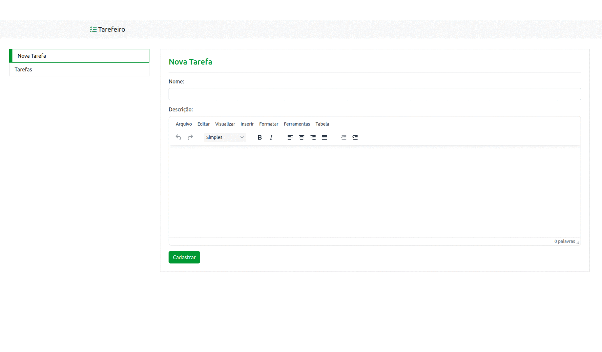

## Apresentação Geral

**Nome do Projeto:** Gerenciador de Tarefas

**Descrição:**

O Gerenciador de Tarefas (Tarefeiro) é uma aplicação intuitiva e eficiente, projetada para facilitar o registro e a organização das suas atividades diárias. 
Com uma interface simples e prática, você pode facilmente criar, editar e navegar por suas tarefas importantes. Mantenha-se produtivo e 
organizado com o Tarefeiro, onde você pode gerenciar suas responsabilidades de forma eficaz.



**Objetivo:**

Implementar um gerenciador de tarefas em PHP.

**Tecnologias Utilizadas:**


## Para Desenvolvedores

Se você é um desenvolvedor interessado em contribuir ou entender melhor o funcionamento do projeto, aqui estão algumas informações adicionais:

**Ambiente:**


```sql
CREATE DATABASE IF NOT EXISTS `task_manager`;

USE `task_manager`;

CREATE TABLE IF NOT EXISTS `task` (
    `id` int NOT NULL AUTO_INCREMENT,
    `status` ENUM('0', '1') NOT NULL DEFAULT '0',
    `task_name` VARCHAR(100) NOT NULL,
    `task_description` VARCHAR(1000),
    `date_added` DATETIME NOT NULL DEFAULT NOW(),
    PRIMARY KEY (`id`)
);
```

**Instruções de Instalação e Configuração:**

> Atenção: Obrigatório o uso de Docker em sua máquina.

1. Clone o repositório do projeto:
```
git clone https://github.com/edssaac/gerenciador-de-tarefas
```

2. Navegue até o diretório do projeto:
```
cd gerenciador-de-tarefas
```

3. Inicie a aplicação atráves do script que configura o Docker:
```
.ci_cd/init.sh  
```
Com isso a aplicação estará acessivel: [http://localhost:8080](http://localhost:8080)

---

4. Quando desejar encerrar a aplicação, use:
```
.ci_cd/stop.sh
```
Caso deseje encerrar e remover os volumes criados, use:
```
.ci_cd/stop.sh -v
```

## Contato

[](https://github.com/edssaac)
[](mailto:edssaac@gmail.com)
[](mailto:edssaac@outlook.com)
[](https://www.linkedin.com/in/edssaac)
